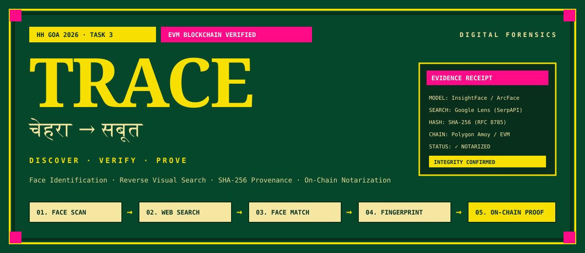
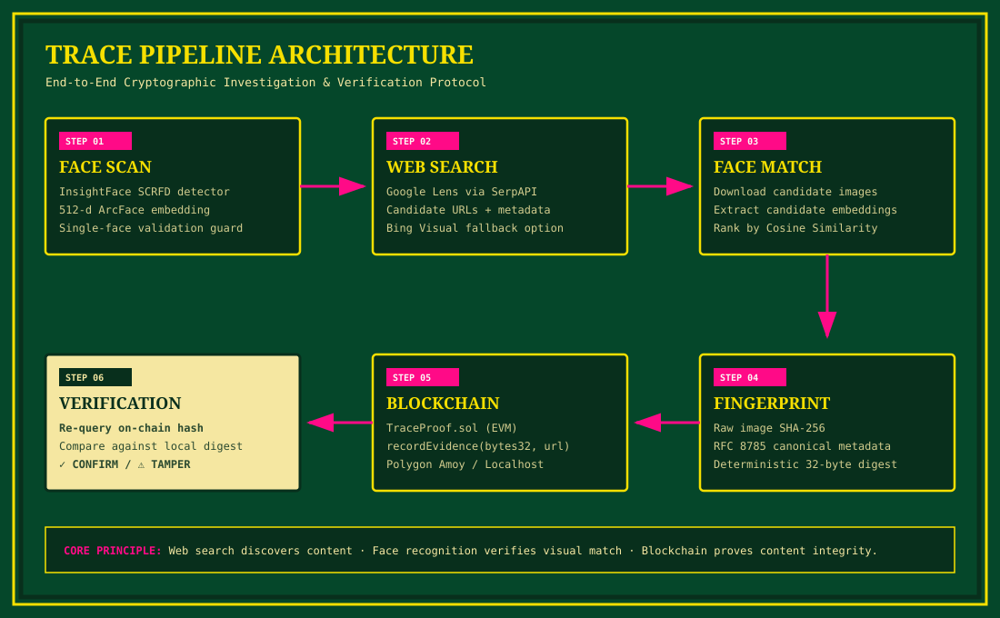

<div align="center">



# TRACE
### चेहरा → सबूत · DISCOVER · VERIFY · PROVE

[](contracts/contracts/TraceProof.sol)
[](backend/)
[](frontend/)
[](backend/app/ml/)
[](https://amoy.polygonscan.com/)

**A Digital Investigation &amp; Content Provenance Tool**  
*Built for Hackers House Goa 2026 — Task 3: Face Identification &amp; Blockchain Verification*

---

</div>

## 📌 Core Conceptual Distinction

> **WEB SEARCH DISCOVERS CONTENT.**  
> **FACE RECOGNITION VERIFIES VISUAL MATCH.**  
> **BLOCKCHAIN PROVES CONTENT INTEGRITY.**

TRACE is designed with a forensics-first mindset. It **never claims to identify the real-world identity/name of an individual**. Instead, it computes mathematical visual similarity scores between discovered public sources and anchors immutable cryptographic fingerprints to a public blockchain.

---

## 🏛️ Pipeline Architecture



### The 6-Stage Provenance Loop:

```
[01. UPLOAD IMAGE]
       │
       ▼
[02. FACE SCAN] ────────────► SCRFD Detection + 512-d ArcFace Unit Vector
       │
       ▼
[03. WEB SEARCH] ───────────► Google Lens Reverse Search (SerpAPI / Bing)
       │
       ▼
[04. VISUAL MATCH] ─────────► Candidate Download + Cosine Similarity Ranking
       │
       ▼
[05. FINGERPRINT] ──────────► Deterministic SHA-256 (RFC 8785 Canonical JSON)
       │
       ▼
[06. ON-CHAIN NOTARIZATION] ► TraceProof.sol (EVM / Polygon Amoy)
       │
       ▼
[07. TAMPER VERIFICATION] ──► On-Chain Re-Query & Bit-for-Bit Integrity Check
```

---

## 🎨 Visual Design System (Goa Poster Forensics)

The user interface rejects generic SaaS dashboards, purple AI glassmorphism, and standard crypto templates. It is inspired by **contemporary Goan screen-printed street posters** mixed with digital forensics tooling:

| Token | Hex Code | Visual Role |
|---|---|---|
| **Goa Green** | `#05472A` / `#006B3C` | Deep canvas & background environment |
| **Sunflower Yellow** | `#F7E000` | Primary typography, highlights & action triggers |
| **Hot Pink** | `#FF0A87` | Forensics annotations, active states & warnings |
| **Ink** | `#082F1C` | Dark screen-print borders & evidence containers |
| **Cream** | `#F5E7A1` | Metadata receipts, data badges & subheadings |

---

## 🔬 Technical Implementation

### 1. Face ML Engine (`backend/app/ml/`)
- **Detection**: SCRFD (Sample and Computation Redistribution for Face Detection) with sub-pixel landmark localization.
- **Embedding**: 512-dimensional ArcFace unit-normalized vectors ($\|v\|_2 = 1.0 \pm 1e-4$).
- **Visual Similarity**: Calibrated cosine similarity metrics:
  $$\text{Cosine Similarity} = \frac{\mathbf{u} \cdot \mathbf{v}}{\|\mathbf{u}\| \|\mathbf{v}\|}$$
  $$\text{Calibrated Match Score} = \max\left(0.0, \min\left(100.0, \frac{\text{sim} - 0.2}{0.8} \times 100\right)\right)$$
- **Guards**: Enforces single-face analysis, flagging zero-face inputs or rejecting multi-face ambiguity.

### 2. Live Reverse Image Search (`backend/app/search/`)
- **Zero Mock Data in Production**: Genuine web search via Google Lens (SerpAPI engine) or Microsoft Bing Visual Search API v7.
- **Candidate Processing**: Downloads accessible candidates, crops faces, computes candidate embeddings, and ranks by visual match score.

### 3. Two-Tier Content Fingerprinting (`contracts/lib/` & `backend/app/blockchain/`)
- **Image Hash**: Raw binary SHA-256 digest of discovered image bytes.
- **Composite Metadata Digest**: RFC 8785 canonical JSON serialization ensuring **100% byte-for-byte parity across Python and TypeScript**:
  ```json
  {"image_sha256":"fe5a127a...","source_url":"https://example.com/post","timestamp":1788653519,"title":"Source Title"}
  ```

### 4. Smart Contract Provenance (`contracts/contracts/TraceProof.sol`)
- Gas-optimized packed storage struct recording `contentHash`, `sourceReference`, `timestamp`, `blockNumber`, and `recordedBy`.
- Write-once immutability: Reverts on duplicate hash registration (`EvidenceAlreadyExists`).
- View queries: `getEvidence()`, `verifyEvidence()`, and indexed audit enumerations.

---

## 🚀 Quickstart & Local Setup

### Prerequisites
- Node.js 18+
- Python 3.11+
- Git

### 1. Clone the Repository
```bash
git clone https://github.com/imnottaken/trace.git
cd trace
```

### 2. Configure Environment
```bash
cp .env.example .env
```
Edit `.env` and provide your SerpAPI key (or Bing key):
```env
SEARCH_PROVIDER=serpapi
SERPAPI_API_KEY=your_serpapi_key_here
BLOCKCHAIN_RPC_URL=http://127.0.0.1:8545
```

### 3. Deploy Local Blockchain & Smart Contract
```bash
# Terminal 1: Start local EVM node
cd contracts
npm install
npx hardhat node

# Terminal 2: Deploy TraceProof.sol
cd contracts
npx hardhat run scripts/deploy.ts --network localhost
# Note the printed contract address and ensure CONTRACT_ADDRESS in .env matches
```

### 4. Start Backend API Server
```bash
# Terminal 3: Launch FastAPI server
cd ..
pip install -r backend/requirements.txt
python -m uvicorn backend.app.main:app --host 0.0.0.0 --port 8000 --reload
```

### 5. Start Frontend UI
```bash
# Terminal 4: Launch Next.js App
cd frontend
npm install
npm run dev
```

Open **[http://localhost:3000](http://localhost:3000)** in your browser.

---

## 🎬 60-Second Screen Recording Demo Guide

1. **Open TRACE**: Navigate to `http://localhost:3000`.
2. **Upload Portrait**: Drop a publicly indexed portrait (e.g. from Wikipedia/news) into the dropzone.
3. **Trigger Pipeline**: Click **BEGIN TRACE →**.
4. **Observe Real-Time Timeline**:
   - `✓ FACE ANALYSIS` (SCRFD bounding box & 512-d ArcFace embedding).
   - `✓ WEB DISCOVERY` (Google Lens discovers public sources).
   - `✓ CANDIDATE MATCHING` (Face cosine similarity ranking).
   - `✓ CONTENT FINGERPRINT` (Deterministic SHA-256 generated).
   - `✓ BLOCKCHAIN PROOF` (Transaction confirmed on EVM node).
5. **Inspect Evidence**:
   - Review side-by-side match comparison and similarity percentage.
   - Click `VIEW SOURCE ↗` to inspect original online publication.
   - Check block number, transaction hash, and SHA-256 digest blocks.
6. **Demonstrate Tamper Verification**:
   - Re-upload the exact discovered image → **✓ VERIFIED (CONTENT INTEGRITY CONFIRMED)**.
   - Slightly edit or re-save the image with 1 pixel changed → **⚠ CONTENT MODIFIED (FINGERPRINTS DO NOT MATCH)**.

---

## 📦 Monorepo Structure

```
trace/
├── backend/                      # Python FastAPI application
│   ├── app/
│   │   ├── main.py               # API routes & orchestration
│   │   ├── config.py             # Pydantic settings & env validation
│   │   ├── ml/
│   │   │   ├── face_engine.py    # InsightFace & ONNX ArcFace engine
│   │   │   └── weights_loader.py # Model downloader & cache manager
│   │   ├── search/
│   │   │   ├── providers.py      # SerpAPI / Bing / Mock abstractions
│   │   │   └── candidate_matcher.py # Visual comparison & ranking
│   │   └── blockchain/
│   │       ├── fingerprint.py    # RFC 8785 deterministic SHA-256
│   │       ├── chain_service.py  # Web3.py EVM contract interface
│   │       └── abi/TraceProof.json
│   └── requirements.txt
│
├── frontend/                     # Next.js 14 App Router
│   ├── src/
│   │   ├── app/
│   │   │   ├── page.tsx          # Master investigation workflow
│   │   │   ├── layout.tsx        # Poster typography & metadata
│   │   │   └── globals.css       # Goa poster styling & tokens
│   │   ├── components/
│   │   │   ├── TraceLogo.tsx
│   │   │   ├── UploadZone.tsx
│   │   │   ├── InvestigationTimeline.tsx
│   │   │   ├── MatchComparison.tsx
│   │   │   ├── FingerprintDisplay.tsx
│   │   │   ├── BlockchainProof.tsx
│   │   │   ├── VerificationResult.tsx
│   │   │   └── TamperCheck.tsx
│   │   └── lib/
│   │       └── api.ts            # Typed client SDK
│   └── tailwind.config.ts
│
├── contracts/                    # Solidity smart contracts
│   ├── contracts/
│   │   └── TraceProof.sol        # Immutable evidence registry
│   ├── test/                     # 96 Hardhat & adversarial test cases
│   ├── scripts/deploy.ts         # Multi-network deployment script
│   └── hardhat.config.ts         # Localhost & Polygon Amoy setup
│
├── docs/assets/                  # Vector illustrations & diagrams
├── .env.example
├── .gitignore
└── README.md
```

---

## 🔒 Privacy & Limitations Disclaimer

- **Prototype Context**: This software is a proof-of-concept for HH Goa 2026.
- **Biometric Data**: Biometric embeddings require strict privacy considerations (GDPR, encryption at rest, explicit consent). Embeddings are never stored permanently in this prototype.
- **Search Provider Rate Limits**: Reverse search latency depends on external search provider quotas and network availability.
- **Scope**: Designed for visual verification and digital provenance, not autonomous surveillance or personal identification.

---

<div align="center">
  <sub>Built with ❤️ for <b>Hackers House Goa 2026</b></sub>
</div>
